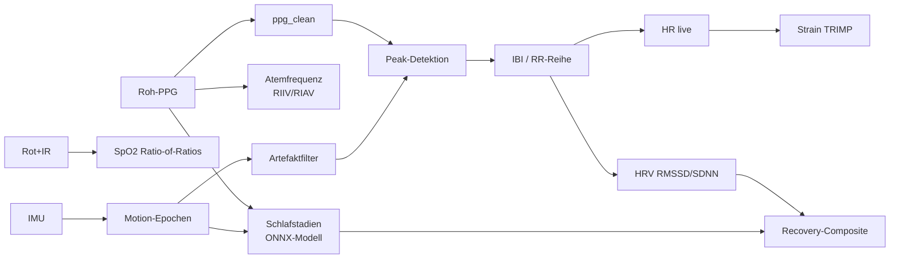
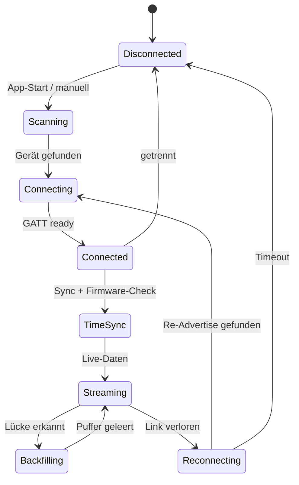
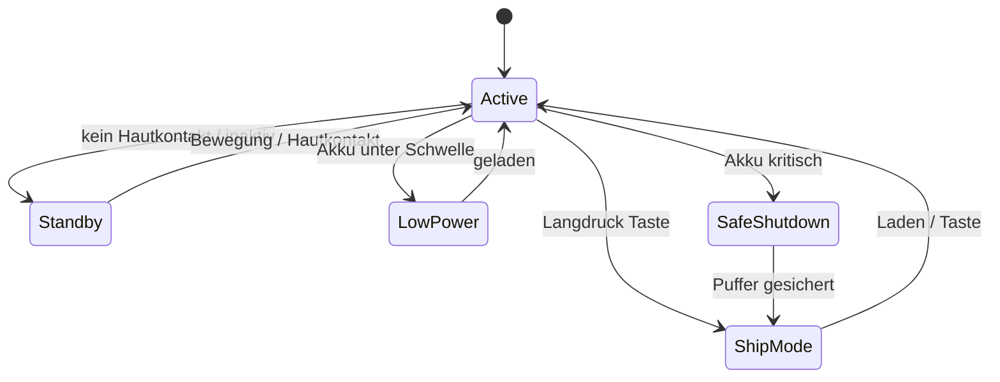
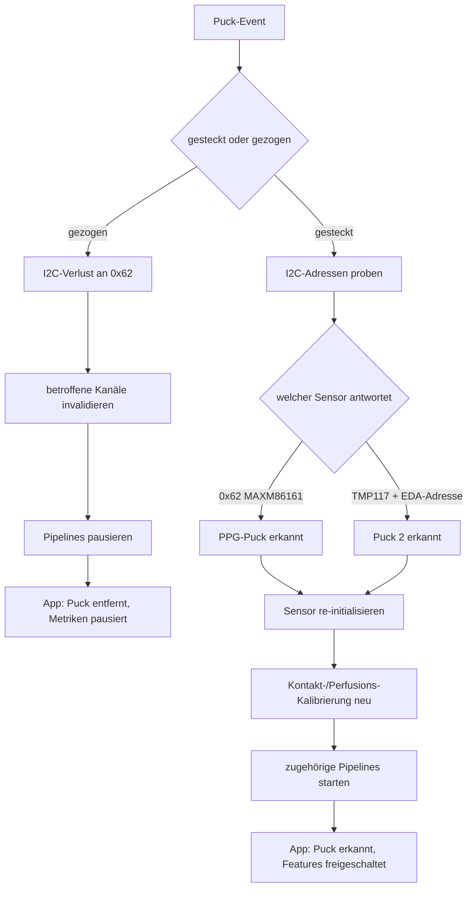

# OpenPulse App — Masterplan & Architektur

**Companion-App für iOS und Android**
Stand: Konzept, vor Exekution. Hardware-Basis: Mainboard XIAO nRF52840 Sense (Zephyr RTOS), Puck 1 (MAXM86161 PPG).

---

## 0. Zielbild und Leitprinzipien

Die App ist die Companion-Schicht zum OpenPulse-Wearable. Sie übernimmt vier Rollen: BLE-Brücke zum Gerät, lokaler Datenspeicher, Präsentationsschicht auf WHOOP-Niveau und Steuerzentrale für Gerät und Pucks.

Sechs Prinzipien tragen den gesamten Entwurf:

1. **Erprobte Verfahren statt Eigenbau.** Die Sensordaten des PPG-Pucks werden über etablierte, validierte Pipelines verarbeitet (NeuroKit2 als Referenz, SleepPPG-Net-Klasse für Schlafstadien, dokumentierte Recovery- und Strain-Modelle). OpenPulse komponiert bestehende Methoden, der Wert liegt in Integration und Transparenz.
2. **Standalone-First.** Alle Kernfeatures laufen ohne Backend direkt auf dem Telefon. Eine optionale selbst-hostbare Sync-Schicht dient Backup, Multi-Device und Research-Export.
3. **Lokal-first und Datensouveränität.** Rohdaten und Auswertung verbleiben standardmäßig auf Gerät und Telefon. Export und optionaler Cloud-Sync sind opt-in und MQTT-konform.
4. **Modularität spiegelt Hardware.** Verfügbare Features ergeben sich aus dem gesteckten Puck. Die UI baut sich entsprechend auf.
5. **Robustheit vor Reichtum.** Jeder Zustand (Verbindung weg, Akku leer, Puck gezogen, Telefon aus) hat ein definiertes Verhalten mit Datenintegrität.
6. **Keine medizinischen Aussagen.** Sämtliche Texte und Scores bleiben außerhalb des MDR-Geltungsbereichs (Wellness-Framing, kein Diagnose- oder Therapieanspruch).

---

## 1. Hardware-Kontext und ableitbare Signale

| Komponente | Relevanz für die App |
|---|---|
| nRF52840 (1 MB Flash, 256 KB RAM) | BLE-Stack, Live-Verarbeitung im Edge, System-OFF Tiefschlaf |
| QSPI-Flash 2 MB (P25Q16H auf Sense) | Ringpuffer für Offline-Logging (Telefon aus, Verbindung weg) |
| IMU LSM6DS3TR-C (auf Mainboard) | Aktigrafie für Schlaf, Bewegungs-Artefaktfilter für PPG, Aktivitätserkennung |
| MAXM86161 (Puck 1) | Grün/Rot/IR LEDs, 19-Bit ADC, FIFO 128, I2C 0x62 |
| LiPo 1S ~250 bis 280 mAh | Akku-Modell, Laufzeitprognose, Ladezustand über ADC P0.31 (AIN7), Enable P0.14 |

Der MAXM86161 besitzt drei separat steuerbare optische Kanäle (Grün, Rot, IR). Damit liefert Puck 1 hardwareseitig mehr als HR: Grün für HR und HRV, Rot plus IR für SpO2-Ableitung (Ratio-of-Ratios), und atemmodulierte Variationen im PPG für Atemfrequenz. Der IMU sitzt auf dem Mainboard und steht damit unabhängig vom gesteckten Puck zur Verfügung.

**Direkt aus Puck-1-Signalen ableitbar:**
HR (live), IBI/RR-Intervalle, HRV (RMSSD, SDNN und weitere Zeitdomäne; Frequenzdomäne bei ausreichend langem Fenster), Ruhepuls, Atemfrequenz, SpO2 (mit Kalibrierung), Bewegung/Aktivität, Schlaf-Wach und Schlafstadien (PPG plus Aktigrafie), Recovery, Strain, Tagesstress (HR/HRV-basiert).

---

## 2. Systemarchitektur

Fünf Schichten, klar getrennt, jede einzeln testbar. Die Trennung folgt derselben Logik wie die Software-Layer-Architektur des Gesamtprojekts: Acquisition und Primitives laufen früh und stabil, Composite und Output bauen darauf auf.

```mermaid
graph TD
    subgraph Device["OpenPulse Wearable (Zephyr)"]
        S1[Sensor-Treiber<br/>MAXM86161 / IMU]
        S2[Edge-Verarbeitung<br/>Live-HR, Motion-Epochen]
        S3[Flash-Ringpuffer<br/>Offline-Logging]
        S4[BLE GATT Server]
        S1 --> S2 --> S3
        S2 --> S4
        S3 --> S4
    end

    S4 -.BLE.-> A1

    subgraph App["Companion App (Flutter)"]
        A1[BLE-Layer<br/>Scan/Connect/Stream/Backfill]
        A2[Lokale Time-Series DB]
        A3[Verarbeitung<br/>nativ + ONNX/TFLite]
        A4[State Manager]
        A5[UI / OpenPulse Theme]
        A1 --> A2 --> A3 --> A4 --> A5
        A1 --> A4
    end

    A2 -.opt. Sync.-> C1

    subgraph Optional["Selbst-hostbar / Cloud (opt-in)"]
        C1[MQTT Broker]
        C2[NeuroKit2-Pipeline<br/>Research / Dashboard]
        C3[Backup / Export]
        C1 --> C2
        C1 --> C3
    end
```

Die optionale Schicht ist identisch zum bestehenden internen Stack (MQTT, NeuroKit2, Streamlit/Python-Dashboard). Die App benötigt sie für Kernfunktionen nicht, sie bleibt die Single Source of Truth für Research und liefert die Validierungsbasis für die On-Device-Implementierungen.

---

## 3. Technologie-Stack

**Empfehlung: Flutter (Dart).**
Begründung: ein Codebase für iOS und Android, hohe Gestaltungsfreiheit für die WHOOP-nahe, eigenständige UI, performante Custom-Animationen, ausgereiftes BLE über `flutter_blue_plus`, On-Device-Inferenz über `onnxruntime` oder `tflite_flutter`. Lokale Time-Series über Drift (SQLite) oder Isar.

**Alternative 1: Native (Swift + Kotlin).**
Stärkste BLE-Hintergrundzuverlässigkeit (besonders iOS CoreBluetooth State Restoration) und feinste Plattform-Integration. Kosten: zwei Codebases, doppelter UI-Aufwand. Sinnvoll, falls BLE-Hintergrundverhalten in Tests zum Engpass wird. Hier kann ein nativer BLE-Kern unter einem Flutter-UI-Layer via Platform Channels als Hybrid dienen.

**Alternative 2: React Native.**
Solide über `react-native-ble-plx`. Schwächer bei rechenintensiver On-Device-Verarbeitung und sehr individuellen Visualisierungen.

**Verarbeitungs-Strategie (Schlüsselentscheidung):**

- **On-Device, nativ:** HR, HRV-Zeitdomäne, Ruhepuls, Atemfrequenz, Strain, SpO2. Diese Mathematik ist dokumentiert und leichtgewichtig. Sie wird faithfully implementiert und in der Entwicklung gegen NeuroKit2 verifiziert (gleiche Methode, kein neuer Algorithmus).
- **On-Device, ML-Runtime:** Schlafstadien über ein exportiertes Modell der SleepPPG-Net-Klasse (ONNX/TFLite). Läuft batch über Nacht, kein Cloud-Zwang.
- **Backend, optional:** NeuroKit2-Vollpipeline für Research-Export, Frequenzdomäne-HRV-Tiefenanalyse, Dashboard.

Damit arbeitet die App eigenständig mit vollem Funktionsumfang, und die erprobten Verfahren bleiben die Grundlage.

---

## 4. BLE-Protokoll (GATT)

Standard-Services wo möglich, Custom-Service für Streaming und Steuerung. MTU-Negotiation auf Maximum (247 Byte), 2M PHY wo verfügbar.

| Service | UUID | Characteristics | Eigenschaft |
|---|---|---|---|
| Device Information | 0x180A | Firmware-, Hardware-, Serial-Number | Read |
| Battery | 0x180F | Battery Level (0 bis 100) | Read, Notify |
| OpenPulse Control | Custom | Time-Sync, Modus, Sampling-Rate, LED-Strom, Puck-Identität | Read/Write/Notify |
| OpenPulse Live Stream | Custom | gepackte Sensor-Frames (HR, IBI, Motion, optional SpO2) | Notify |
| OpenPulse Bulk/Backfill | Custom | komprimierte Historie aus Flash-Puffer | Notify, Indicate |
| OpenPulse Raw PPG | Custom | Roh-PPG-Fenster on demand (Diagnose/Kalibrierung) | Notify |
| DFU (SMP) | Custom | OTA über MCUboot | Read/Write |

**Streaming-Design.**
Live-Frames werden gepackt und gebatcht (mehrere Samples pro Notify), um Funkzeit und Stromverbrauch zu senken. Ruhezustand nutzt lange Connection-Intervalle (z. B. 200 bis 500 ms) plus Slave Latency. Aktive Messung verkürzt das Intervall. Roh-PPG wird nicht dauerhaft übertragen, sondern nur in kurzen Fenstern für Kalibrierung und Diagnose.

**Zeitmodell.**
Das Gerät zählt relativ zu seiner internen Uhr (RTC ohne gepufferte Echtzeit). Bei jedem Connect schreibt die App einen Zeitstempel in die Control-Characteristic. Das Gerät versieht jeden Datensatz mit `device_uptime`, die App rekonstruiert die Wandzeit aus der letzten Synchronisation plus Offset. Konflikte werden über Zeitstempel und Dedup aufgelöst.



---

## 5. Datenpufferung und Offline-Verhalten

Der 2-MB-QSPI-Flash trägt das gesamte Offline-Szenario.

**Speicherbudget (kompakte Aggregate, 1-Minuten-Raster).**
Pro Minute rund 8 bis 12 Byte (HR-Mittel, HRV-Fenster, Motion-Aktivität, optional SpO2, Akku, Flags). Bei rund 14 KB pro Tag fasst der Puffer über 100 Tage Aggregate.

**Nacht-IBI für HRV-Genauigkeit.**
Eine volle Nacht roher IBI-Werte (rund 8 h bei 60 bpm) belegt etwa 55 bis 60 KB. Der Puffer hält damit die letzten rund 30 Nächte vollständig, ältere Nächte verdichten sich zu Aggregaten.

**Roh-PPG** wird nicht dauerhaft gespeichert, sondern live gestreamt oder fensterweise auf Anfrage geliefert.

Ergebnis: Das Telefon kann tagelang aus sein, ohne Datenverlust. Bei Reconnect läuft Backfill über die Bulk-Characteristic, dedupliziert per Zeitstempel.

---

## 6. Datenverwertung mit erprobten Verfahren

| Metrik | Verfahren / Quelle | Benötigte Hardware | Reife |
|---|---|---|---|
| HR live | NeuroKit2 `ppg_process` (Referenz), nativ on-device | Puck 1 grün | hoch |
| HRV (RMSSD, SDNN, Zeitdomäne) | NeuroKit2 `hrv_time`, nativ on-device; HRV-CV als Stabilitätslayer | Puck 1 grün | hoch |
| Ruhepuls (RHR) | nächtliches HR-Minimum-Fenster, dokumentierte Methode | Puck 1 grün | hoch |
| Atemfrequenz | atemmodulierte PPG-Variation (RIIV/RIAV), NeuroKit2 / pyPPG | Puck 1 grün | mittel bis hoch |
| SpO2 | Ratio-of-Ratios Rot/IR, geräteindividuelle Kalibrierung | Puck 1 Rot+IR | mittel, Kalibrierung nötig |
| Bewegung/Aktivität | IMU-Aktigrafie, Schwellen plus Klassifikation | Mainboard-IMU | hoch |
| Schlaf-Wach | Aktigrafie (Cole-Kripke-Klasse) plus nächtliches HR | IMU + Puck 1 | hoch |
| Schlafstadien (4-Klassen) | SleepPPG-Net-Klasse, exportiert nach ONNX/TFLite | Puck 1 + IMU | state-of-the-art, Validierung nötig |
| Recovery / Readiness | Composite aus nächtlichem RMSSD, RHR, Schlafqualität gegen rollende Baseline | Puck 1 + IMU | hoch, etablierte Methode |
| Strain / Load | TRIMP (Banister/Edwards) über HR-Zonen, Skala 0 bis 21 | Puck 1 | hoch |
| Tagesstress | HR/HRV-basiert, Skala niedrig bis hoch | Puck 1 | mittel |

**Recovery-Composite im Detail (dokumentierte Methode, kein Eigenbau).**
Eingänge: HRV (RMSSD, gemessen im stabilen Tiefschlaf, analog WHOOP), Ruhepuls und Schlafqualität. Jeder Eingang wird gegen die persönliche rollende Baseline normiert (7-Tage-Fenster gegen 30- bis 60-Tage-Normal, z-Score). Gewichtete Aggregation auf 0 bis 100, Zonierung Grün/Gelb/Rot. Die App zeigt zusätzlich die Beitragsfaktoren (was hat den Score gesenkt), nicht nur die Zahl.

**Baseline und Kalibrierung über Tage.**
Pro Metrik wird ein rollender Baseline-Speicher geführt. In den ersten Nächten sind Scores provisorisch markiert, bis genügend Datenpunkte vorliegen (Richtwert 4 bis 7 Nächte). Danach werden Baselines kontinuierlich nachgeführt, sodass sie aktuelle Fitness und Belastung abbilden statt einer Momentaufnahme.

---

## 7. Feature-Set nach Puck-Stufe

**Puck 1 (heute verfügbar):**
HR live, HRV-Trend, Ruhepuls, Atemfrequenz, SpO2 (Spot oder periodisch), Schlafdauer, Schlafstadien, Schlaf-Score, Recovery-Score, Strain, Tagesstress, Aktivitäts-/Bewegungstracking, Geräte- und Akkustatus, Daten-Export.

**Puck 2 (definiert, TMP117 plus EDA/Bioimpedanz):**
EDA-basierter Stress (deutlich präziser als HR/HRV allein, NeuroKit2 `eda_process` mit SCR/SCL-Zerlegung), Hauttemperatur-Trend, temperaturgestützte Zyklus-Hinweise. EDA ist das Feature, das große Mitbewerber auslassen, und damit ein zentraler Differenzierer.

**Version 2 / ECG (gehäuse-level):**
ECG-Spot-Messung über leitendes Element im Bandverschluss.

Die Featureliste in der UI baut sich nach gestecktem Puck auf. Erkennt das Gerät den PPG-Puck, erscheinen die PPG-Features. Ein zweiter Puck schaltet die zugehörigen Karten frei.

---

## 8. UI/UX-Architektur

### Navigationsstruktur (WHOOP-angelehnt, OpenPulse-eigen)

Bottom-Navigation mit fünf Bereichen. Der Home-Bereich trägt den Großteil der Nutzung, der Rest geht in die Tiefe.

```
┌──────────────────────────────────────────────┐
│  HOME        Tagesüberblick: Recovery-Ring,    │
│              Strain, Schlaf, Live-HR,           │
│              Geräte-/Puck-Status, Alerts        │
├──────────────────────────────────────────────┤
│  RECOVERY    Score, Beitragsfaktoren,           │
│              HRV/RHR-Trend, Baseline-Kontext    │
├──────────────────────────────────────────────┤
│  SCHLAF      Stadien-Hypnogramm, Effizienz,     │
│              Atemfrequenz, Schlafbedarf         │
├──────────────────────────────────────────────┤
│  AKTIVITÄT   Strain, HR-Zonen, Sessions,        │
│              Tagesstress                         │
├──────────────────────────────────────────────┤
│  GERÄT       Pucks, Akku/Laufzeit, Verbindung,  │
│  (OpenPulse) Firmware, Export, Datenhoheit      │
└──────────────────────────────────────────────┘
```

Der GERÄT-Bereich ist der OpenPulse-eigene Teil. Er zeigt gesteckte Pucks visuell, den Akku mit Laufzeitprognose, den Verbindungszustand, Firmware-Updates und die Export-/Souveränitäts-Einstellungen.

### Screen-Inventar (Auswahl)

Onboarding und Pairing, Home-Dashboard, Recovery-Detail, Schlaf-Detail mit Hypnogramm, Aktivität/Strain, Live-Messansicht, Geräte-Übersicht, Puck-Management, Akku-/Laufzeit-Detail, Verbindungs-/Troubleshooting, Firmware-Update, Kalibrierungs-Fortschritt, Export- und Datenschutz-Einstellungen, Verlaufs-/Trendansichten.

### OpenPulse Theme

- **Typografie:** Fraunces (Display/Headlines), Geist (UI/Body), JetBrains Mono (Sensordaten und Zahlenwerte).
- **Farben:** Brand-Palette #D33E43 (Rot), #1C1F33 (Navy), #9B7874 (Rose). Signalfarben pro Puck-Typ für eindeutige Zuordnung der Datenquelle.
- **Gestaltungslinie:** Datentransparenz als sichtbares Prinzip. Jeder Score ist auf seine Rohsignale auflösbar. Das ist der Gegenentwurf zur Black-Box und gehört sichtbar in die UX.

### UX-Prinzipien

Ein-Blick-Verständnis auf Home (Ring, Farbe, Zahl genügen für die Tagesentscheidung). Progressive Disclosure für Tiefe. Konsistente Score-Logik über alle Bereiche. Jeder Gerätezustand hat eine klare, ruhige visuelle Entsprechung statt technischer Fehlermeldung.

---

## 9. Zustandsmaschinen und Edge Cases

Dies ist der Kern. Jeder Zustand hat definiertes Geräte- und App-Verhalten plus Datenintegrität.

### 9.1 BLE-Verbindungszustände



Auto-Reconnect mit Backoff. Das Gerät advertised durchgehend, wenn keine Verbindung besteht. Nach Reconnect immer erst Zeit-Sync, dann Backfill, dann Live.

### 9.2 Geräte-Energiezustände



Ein dediziertes Power-Schalterelement entfällt beim Wearable. "Aus" bedeutet System-OFF auf dem nRF52840 (Ship-Mode, Wake über Laden, Taste oder Bewegung). Langdruck der Taste versetzt das Gerät in den niedrigsten Stromzustand. Standby reduziert Sampling und Funk, bleibt aber tracking-fähig. Die App spiegelt jeden Zustand ("Gerät im Standby", "aktiv", "lädt", "bitte laden").

### 9.3 Akku Gerät: Schwellen und Stromsparstufen

| Ladezustand | Geräteverhalten | App-Verhalten |
|---|---|---|
| über 20 % | normaler Betrieb | Akku plus Laufzeitprognose |
| 20 % | Hinweis | dezente Warnung, Prognose |
| 10 % | LowPower: Sampling reduziert, optionale Kanäle (SpO2/IR) aus, Connection-Intervall länger | klare Warnung, Empfehlung laden |
| 5 % | kritisch: HR-only, minimales Logging | prominenter Hinweis |
| 3 % | SafeShutdown: Puffer in Flash flushen, Clean-Flag setzen, letzten Zeitstempel schreiben, dann ShipMode | "Gerät hat sich sicher abgeschaltet, Daten gesichert" |

### 9.4 Akku leer (geordnetes Abschalten)

Sequenz beim Erreichen der kritischen Schwelle: laufenden Datensatz schließen, Puffer in Flash schreiben, Clean-Shutdown-Flag und letzten Zeitstempel persistieren, in ShipMode wechseln. Bei Wiederaufladen und Reconnect erkennt die App das Clean-Flag, zeigt die Lücke als bekannten Zeitraum und übernimmt den Puffer ohne Korruption.

### 9.5 Telefon aus, App im Hintergrund, Telefon-Akku niedrig

- **Telefon aus oder App beendet:** Das Gerät loggt autonom in den Flash-Ringpuffer weiter. Bei nächstem Connect erfolgt Backfill. Kein Datenverlust für Aggregate und Nacht-IBI.
- **App im Hintergrund:** iOS über CoreBluetooth State Preservation/Restoration, Android über Foreground Service mit persistenter Notification für stabile BLE-Sitzung. Live-Aufnahme läuft reduziert weiter, schwere Verarbeitung wird zurückgestellt.
- **Telefon-Akku niedrig / Low Power Mode:** Die App erkennt den Zustand, senkt Sync-Frequenz und verschiebt rechenintensive Auswertung. Das Gerät puffert in dieser Zeit stärker selbst.

### 9.6 Puck Hotswap (Stecken und Ziehen im Betrieb)



Puck-Identität ergibt sich in der aktuellen Hardware aus den antwortenden I2C-Adressen (MAXM86161 unter 0x62 für Puck 1; TMP117 plus EDA-Chip-Adresse für Puck 2). Ein künftiger ID-Widerstand oder EEPROM würde die Erkennung eindeutiger machen. Beim Re-Seat starten Kontakt- und Perfusionskalibrierung neu, temperatur- und EDA-Baselines werden für den betroffenen Sensor zurückgesetzt. Die UI schaltet die zugehörigen Karten live frei oder pausiert sie.

### 9.7 Kalibrierung und Baseline-Aufbau

Zwei Ebenen. Erstens die Signal-Kalibrierung bei jedem Tragen (Perfusion, Kontakt, LED-Strom, Ambient-Light-Cancellation des MAXM86161). Zweitens die statistische Baseline über Tage (rollende Fenster pro Metrik). Während des Erstaufbaus zeigt die App einen klaren Fortschritt ("Kalibrierung Tag X von 7"), Scores sind bis dahin provisorisch markiert.

### 9.8 OTA Firmware-Update

DFU über MCUboot/SMP. Update nur bei ausreichendem Akku und idealerweise am Ladegerät, resumebar bei Abbruch. Die App prüft die Firmware-Version beim Connect und bietet Updates kontrolliert an.

---

## 10. Akku-Modell und Laufzeitberechnung

Das Gerät hat keinen Fuel-Gauge-IC. Ladezustand wird aus der Zellspannung über ADC P0.31 (AIN7) abgeleitet, kombiniert mit einer Coulomb-Schätzung.

**Spannungsbasierter SoC.**
Zellspannung gegen LiPo-OCV-SoC-Kurve. Da die Spannung unter Last einbricht, wird der gemessene Wert um den Lastabfall des aktuellen Betriebsmodus kompensiert (bekannter Modusstrom mal geschätzter Innenwiderstand), dann auf SoC gemappt.

**Hybrid mit Coulomb-Schätzung.**
Zusätzlich integriert die Firmware den bekannten Stromverbrauch je Betriebsmodus über die Zeit. Das stabilisiert die Anzeige zwischen den eher verrauschten Spannungsmessungen.

**Beispiel-Budget (Richtwerte, in Tests zu verifizieren):**

| Modus | Mittlerer Systemstrom | Laufzeit bei 280 mAh |
|---|---|---|
| HR kontinuierlich + periodische Motion | rund 4 mA | rund 70 h |
| plus SpO2 kontinuierlich | deutlich höher | reduziert, daher SpO2 als Spot/periodisch |
| Standby (System ON idle) | wenige µA bis sub-mA | Tage bis Wochen |
| ShipMode | µA-Bereich | Monate |

Das deckt sich mit dem Laufzeitziel von rund 70 h für mehrtägige Feldsessions. SpO2 läuft daher als Spot- oder Intervallmessung statt durchgehend.

**Laufzeitprognose in der App.**
`verbleibende Laufzeit = SoC mal Kapazität geteilt durch Modusstrom`. Die App zeigt diese Prognose dynamisch, abhängig vom aktiven Modus (kontinuierlich gegen Standby). Ladevorgang wird über VBUS/Ladestatus erkannt, inklusive Time-to-Full-Schätzung. Der Default-Ladestrom des XIAO (50 mA) wird explizit gesetzt, damit er die kleinen Zellraten nicht überschreitet.

---

## 11. Datenhaltung App-Seite und optionaler Sync

**App-lokal:** Time-Series-DB (Drift/SQLite oder Isar). Roh-IBI für jüngste Nächte, 1-Minuten-Aggregate für lange Historie, berechnete Scores. Mehrjahres-Trends ohne Cloud.

**Optionaler Sync (opt-in):** MQTT-konform zum selbst-hostbaren Broker. Dient Backup, Multi-Device und Research-Export. Identisch zum bestehenden internen Stack, damit dieselbe NeuroKit2-Pipeline die Tiefenanalyse fährt.

**Konfliktauflösung:** Last-Write-Wins per Zeitstempel, Dedup über Geräte-Uptime plus Sync-Offset.

---

## 12. Datensouveränität, Export, MDR-Abgrenzung

Lokal-first als sichtbares Produktversprechen. Export als CSV und über das Daten-SDK (Python), passend zur Research- und Open-Source-Zielgruppe. Optionaler Self-Host statt erzwungener Cloud. Sämtliche Texte, Scores und Visualisierungen bleiben im Wellness-Framing, ohne Diagnose- oder Therapieanspruch, um außerhalb des MDR-Geltungsbereichs zu bleiben.

---

## 13. Empfohlene Build-Reihenfolge

1. BLE-Layer und GATT-Vertrag (Gerät plus App), Time-Sync, Connect/Stream/Reconnect.
2. Live-HR und Akku-/Laufzeitanzeige, Geräte- und Puck-Status, Energiezustände.
3. Flash-Ringpuffer und Backfill, Offline-Szenarien (Telefon aus, Verbindung weg).
4. On-Device HR/HRV/RHR/Atemfrequenz/Strain, Verifikation gegen NeuroKit2.
5. Aktigrafie und Schlaf-Wach, dann Schlafstadien über exportiertes ONNX-Modell.
6. Recovery-Composite und Baseline-Logik, Kalibrierungs-Flow.
7. SpO2 mit Geräte-Kalibrierung.
8. UI-Ausbau auf WHOOP-Niveau, OpenPulse-Theme, Trendansichten.
9. Optionaler Sync, Export, Datensouveränitäts-Einstellungen.
10. Puck-2-Features (EDA-Stress, Hauttemperatur) bei verfügbarer Hardware.

---

## 14. Offene Entscheidungen

- **Framework final:** Flutter empfohlen. Native nur, falls iOS-BLE-Hintergrund in Tests zum Engpass wird.
- **Schlafstadien-Modell:** konkrete SleepPPG-Net-Klasse und Gewichte für den ONNX/TFLite-Export auswählen und gegen eigene Daten validieren.
- **Puck-Identität:** kurzfristig über I2C-Adressprobing, mittelfristig ID-Widerstand oder EEPROM im Puck für eindeutige Erkennung.
- **SpO2-Kalibrierung:** Aufwand gegen Nutzen, da grün-optimierter Puck Rot/IR mit Einschränkung liefert.
- **Sync-Default:** rein lokal als Auslieferungszustand, Cloud nur als opt-in.

---

## Referenzen (Verfahren und Bibliotheken)

- **NeuroKit2** — Signalverarbeitung, HRV, EDA, Atemfrequenz (Referenz und Backend).
- **pyPPG** — PPG-Beat-Detektion und Biomarker.
- **SleepPPG-Net / SleepPPG-Net2** (Kotzen et al.) — Schlafstadien aus kontinuierlichem PPG, exportierbar nach ONNX/TFLite.
- **Cole-Kripke** — Aktigrafie Schlaf-Wach (Tier-A-Fallback).
- **Recovery-/Baseline-Methodik** (Altini / HRV4Training, dokumentierte Composite-Logik) — rollende Baseline, RMSSD im Tiefschlaf.
- **TRIMP (Banister/Edwards)** — Strain/Load über HR-Zonen.
- **Ratio-of-Ratios** — SpO2 aus Rot/IR.
- **ONNX Runtime / TensorFlow Lite** — On-Device-Inferenz.
- **flutter_blue_plus** (BLE), **MCUboot/SMP** (OTA-DFU).
- **MAXM86161 Datasheet** (Analog Devices) — Grün/Rot/IR, FIFO, ALC, I2C.
